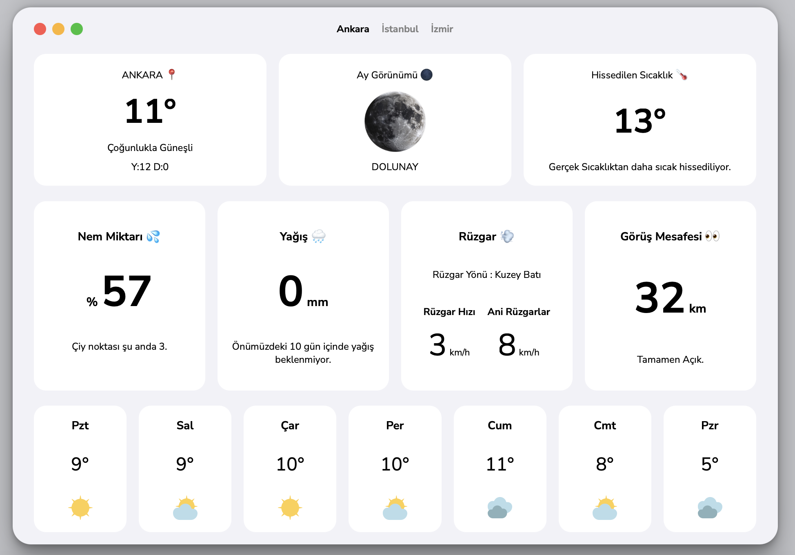

# Hava Durumu Uygulaması

Sadece HTML ve CSS kullanılarak oluşturulmuş basit ve şık bir hava durumu uygulaması.

## Özellikler
- **Flexbox Yapısı:** Temiz ve modern bir düzen için tamamen Flexbox ile tasarlandı.
- **Nem Kartı Animasyonu:** Nem miktarı kartında 180 derece dönme animasyonu ile ön ve arka yüz efekti oluşturuldu.
- **Minimalist Tasarım:** Beyaz tonları kullanılarak özel bir görsel tasarım sağlandı.
- **Kullanıcı Dostu Arayüz:** Tüm kullanıcılar için sezgisel bir deneyim sunar.
- **Tamamen Duyarlı (Responsive):** Farklı ekran boyutlarına ve cihazlara uyum sağlar.

## Kullanılan Teknolojiler
- HTML
- CSS (Flexbox, Animasyonlar, Duyarlı Tasarım)

## Kurulum ve Kullanım
1. Depoyu klonlayın:
   ```sh
   git clone [https://github.com/Oguzhanmst/weather_u-_project]
   ```
2. `index.html` dosyasını tarayıcınızda açarak uygulamayı görüntüleyin.

## Önizleme


## Lisans
Bu proje açık kaynaklıdır.
